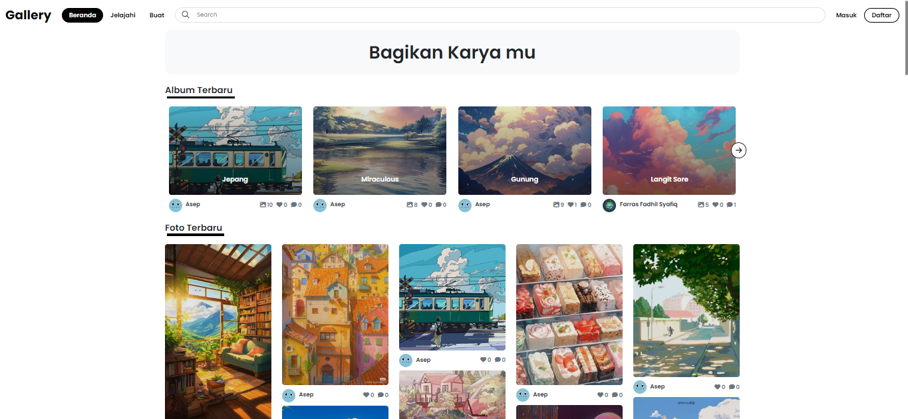
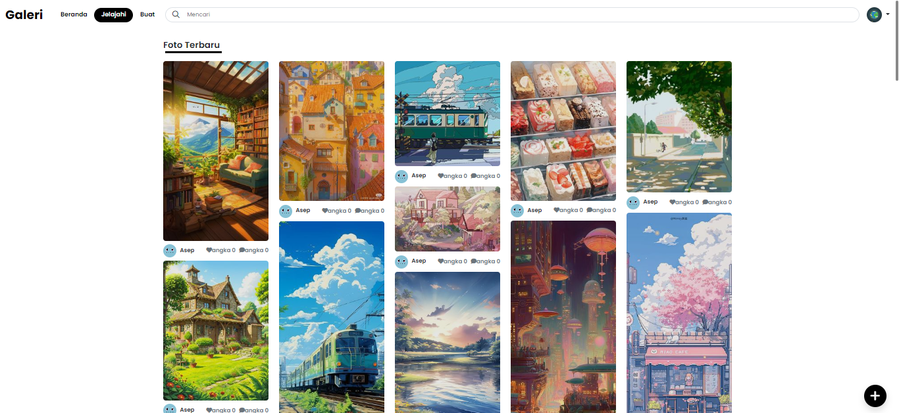
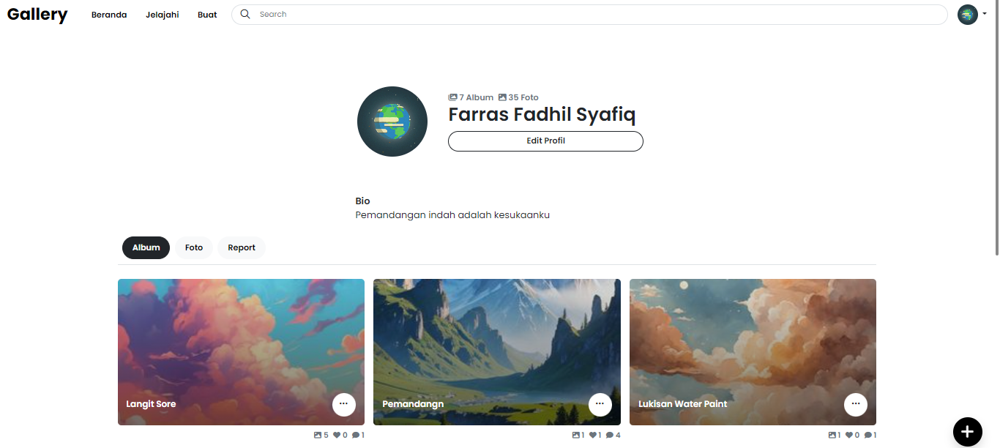

# Gallery Web Application

## About

Gallery Web App is a way of sharing the works with the public. Users would be able to upload their photos, and the application has an image recognition feature that automatically tags and categories them. The site has in place a Masonry layout that displays images dynamically, viewing them attractively. Key features include:

*- **Image Recognition**: Uploaded photos get automatically tagged and categorized.
- Masonry Layout: Results of pictures come in grid layout. Pictures automatically change according to different screen sizes.
- Like, Comment, and Follow: Facility of liking any photo, making comments on any photo, and following other users.
- Photo Management: This feature is also available for managing photos.
- Built with Laravel 10 and Bootstrap: Latest Laravel framework at the backend, bootstrap at frontend for responsive design.

## Table of Contents

- [Features](#features)
- [Screenshots](#screenshots)
- [Installation](#installation)

## Features

* **Masonry Layout**: It creates an eye-catching view of a photo album
* **User Interactions**: Provides functionality to enable user interaction with photos like liking and commenting and following other users for building up a community.
* **Photo Management**: Helps keep your photos organized into albums and be able to manage them.
* **Responsive design** Insures consistent user experience across all devices.

## Screenshots

### Home Page


### Photo Gallery


### User Profile


## Installation
This project contains examples images, so the repository size might be large when you pull or clone it.

### Prerequisites

- **PHP >= 8.0**
- **Composer**
- **Mysql**

### Steps

1. **Clone the Repository**
   ```bash
   git clone https://github.com/Farraskuy/Gallery.git
   cd gallery
   composer install

   # if the migrate error you can import the database manualy (sql file in root directory)
   php artisan migrate
   php artisan storage:link
   php artisan key:generate

   # configure .env then
   php artisan serve
    ```

## Conclusion

The Gallery Web App is full-featured for photo sharing and community building: from sharing one's own photos, interacting with others and making sure everything runs smoothly and remains a joy.

To extend this, you can read through Official Documentation, or simply contact support with any questions you may have.

Enjoy sharing!

